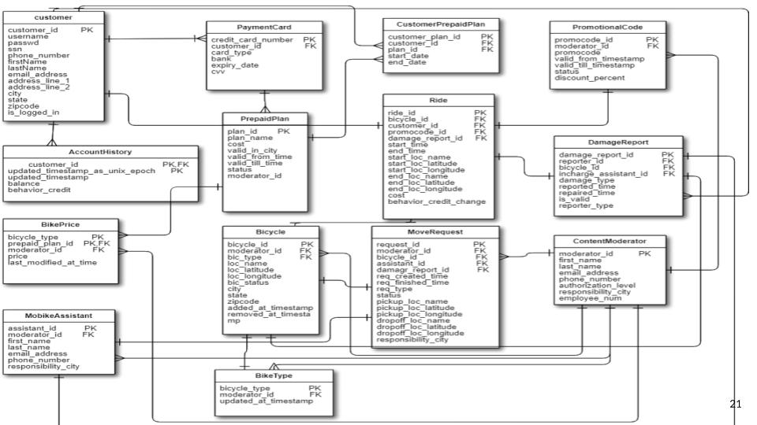

## Demonstration of stored procedures and database triggers through design of a Bike Rental company's database. 
For certain tasks that need manipulation of data stored in the database using the tools provided by the database itself - like stored procedures, functions and triggers - provide better performance, consistency and reliability than writing custom application code. Using a bike rental company's data model, the project demonstrates certain use cases that are better handled at the database layer itself.

We implemented the db design and created an interface in React to showcase power of built-in capabilities of fucntions, triggers and procedures which can help share the load of performing business logic at the databasse tier itself whenever possible.

### Case: Mobike - A Bike Rental company

Mobike is a company that lets users rent bikes for any amount of time. Many different types of bikes can be rented through Mobike's app. It offers various payment plans - one of which the customers needs to subscribe to in order to be able to rent a bike. Mobike operates in many different cities. The company relies on its database to document all aspects of its operations. 

#### Database User Types
For the purposes of this project, the following are the main user types that interact on a regular basis with the Mobike database through the app

* Customer - User who intends to rent a bike. Users can also report damaged bikes. Users are asssigned scores on the basis of their past behavior wrt. their interactions with Mobike.
* Content Moderator - Mobike Employees who are responsible for content and its state on the app
* Mobike Assistant - Mobike Employees who work in the field and are responsible for transportation of bikes.

#### Using Stored Procs and Triggers to enforce business constraints

The following list shows some constraints that the database needs to enforce and we implement these constraints using Stored Procedures and Triggers 

#### Some Constraints for which Mobike uses Database Triggers

1. Goal: Ensure Customer Has Good Behavior Score and is thus allowed to create a report.
Trigger Name: __EnsureCustomerHasPositiveBehaviorScore__ BEFORE INSERT ON DamageReport

2. Goal: Ensure that a damaged report is assigned a content moderator from the region to keep track of it
Trigger Name: __FillContentModeratorId__ BEFORE INSERT ON DamageReport

3. Goal: Automatically create a Move Request (request for the bike to be moved by a Mobike Assistant) for a bike that is reported as damaged. The request should use the nearest repair centre as the target location for the move request
Trigger Name: __CreateMoveRequestForDamagedBike__ AFTER INSERT ON DamageReport

4. Goal: If a Mobike Assistant finds that a bike that was reported as damaged, is actually not damaged, he/she will flag the report as invalid and the user who reported it should be automatically penalised by a reduction in his/her behavior score for making a false report
Trigger Name: __PenaliseForInvalidDamageRequest__ AFTER UPDATE ON DamageReport

5. Goal: Ensure that a bike is in 'available' state before a new ride is started (a record is inserted in the Ride table). If the bike is, for example, in 'damaged' state the app would not allow the user to take it for a ride.
Trigger Name: __EnsureBikeAvailableBeforeStartingRide__ BEFORE INSERT ON Ride
    
6. Goal: Ensure that a customer is on a plan and has enough balance before a ride is started.
Trigger Name: __EnsureCustomerHasPositiveBalanceAndValidPlan__ BEFORE INSERT ON Ride
    
7. Goal: Mark a bike's state as 'in use' when it is used in a ride so that application does not accidently show it under available bikes to other users.
Trigger Name: __MarkBikeInUseForRide__ BEFORE INSERT ON Ride

#### Some Functions that Mobike uses to perform some operations

1. **calculateRideCost(rideId)** Returns the cost for the ride
Goal: The goal of this function is to:
  * Find out the price per hour of the bike used in the ride as per the customer’s current plan
  * Calculate the duration of the ride
  * Figure out the cost for the ride

2. __canBikeBeRemoved(bikeId)__ Returns True/False
Goal: Ensure that the bike is not ‘in use’ status and thus prevent accidental deletion of a bike being used currently in a ride

3. __getAssistantWithLeastMoveRequestsLoad(bikeId)__ Returns an assistant’s id
Goal: This function is useful when assigning a new moverequest to an assistant. It tries to find out the assistant with the relatively least amount of load in terms of the number of requests assigned to him/her. Since move requests are automatically assigned for damage reports, this ensures that the workload for moving them is distributed fairly evenly between Assistants.

4. __getModeratorWithLeastMoveRequestsLoad(bikeId)__ Returns a moderator_id
Goal: This function is useful when assigning a new moverequest to a moderator. It tries to find out the moderator with the relatively least amount of load in terms of the number of requests assigned to him/her. Since move requests are automatically assigned for damage reports, this ensures that the responsibility for managing them is distributed fairly evenly between Moderators for the city.

5. __isPromocodeValid__ Returns True/False
Goal: The goal of this function is to determine if a given promocode is valid. It searches the database for a matching code and tries to determine its valid_till_time, if one is found. Based on whether that time is in the past, it returns a boolean value indicating if the code is valid/invalid.

#### Some Stored Procedures that helps Mobike with databse operations

1. __calculateRideCost(rideId)__ Returns the cost for the ride
The goal of this function is to:
  * Find out the price per hour of the bike used in the ride as per the customer’s current plan
  * Calculate the duration of the ride
  * Figure out the cost for the ride

2. __UpdateBikeStatus(IN status, IN bikeId, OUT successful)__ 
This procedure takes a bikeId as input and updates its status to a given status (received as input) and outputs a boolean value indicating if the status change was successful

3. __ValidateDamageReport(IN damageReportId, OUT is_dr_valid)__ 
This procedure takes a damage report id as input and markes it as valid or invalid in the database.
The is_valid column in the DamageReport table initially has a value of null and this procedure tries to update it when the MobikeAssistant looks at the bike. If the damage report is already marked, it throws an error indicating that the damage report has already been validated/invalidated and this prevents tinkering.

Also, if the Assistant finds the Bike to not be in damaged condition, he/she marks the DamageReport as invalid. That, in turn, changes the bike’s status back to ‘available’ and penalises the customer who made the false report (decrements the customer’s behavior credit score by 2).

4. __UpdateAccountHistoryForCustomer(IN customerId, IN balanceSub,IN behaviorScoreSub, OUT succeeded)__ 
This procedure takes a customer id, balance to be subtracted, and credit score to be subtracted as input. It tries to update the AccountHistory of the associated customer by inserting a new row with new values for the balance, behavior credit score and an updated timestamp. It returns a boolean value indicating the procedure call’s success/failure.

5. __EndRide(IN end_location, IN end_loc_latitude, IN end_loc_longitude, IN rideId, OUT succeeded)__
This procedure takes location values - name, latitude and longitude and a ride id as input. The location values represent the location where a customer ended his/her ride. ride id refers to the row representing this ride in the database. When a ride is ended, the following effects are performed in the database:
  * calculateRideCost function is called to calculate cost of the ride
  * The associated bike’s status is changed to ‘available’
  * The bike’s current location is changed as per the location received when ending the ride.
  * Customer’s account history is updated with respect to this transaction(ride).

It returns a boolean value indicating the procedure call’s success/failure. 

6. __MoveCustomerToNewPlan(IN newPlanId, IN customerId, OUT succeeded)__
This procedure takes a customer id, a prepaid plan id as input. It tries to update the CustomerPrepaidPlan table that holds the plan history for the customer.

The current plan for the customer is identified by the end date being null. So this procedure updates the existing plan’s end date to current time and creates a new row with given plan id ,customer id and null end time representing the new current plan.

7. __FulfillDamageReport(IN damageReportId, OUT succeeded)__
This procedure takes a damage report id as input and changes its status from ‘damaged - sent for repair’ to ‘repaired - ready to move’ indicating that the bike has now been repaired. Also it sets the repaired time to the current timestamp. 
